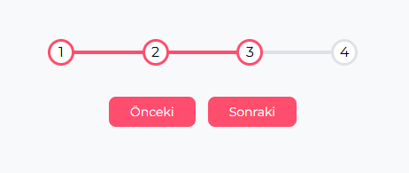

# 🔢 Progress Steps Animation

Bu proje, adım adım ilerleyen kullanıcı arayüzü (progress steps) yapısını göstermek için oluşturulmuş **mini bir web animasyon projesidir.**  
Kullanıcı “Sonraki” ve “Önceki” butonlarını kullanarak ilerleme çubuğu üzerinde animasyonlu geçişler yapabilir.

---

## 🎬 Önizleme



---

## 🧩 Özellikler

- HTML, CSS ve JavaScript ile sade yapı  
- Adım adım ilerleme animasyonu  
- Aktif adımlar için renk geçişi  
- Butonlar aktif/pasif durum değişimi  
- Responsive (mobil uyumlu) yapı

---

## 🧠 Kullanılan Teknolojiler

- **HTML5**
- **CSS3 (transition & flexbox)**
- **Vanilla JavaScript**

---

## ⚙️ Nasıl Çalıştırılır

1. Bu repoyu klonla:
   ```bash
   git clone https://github.com/yigitkagankartal/progress-steps.git
